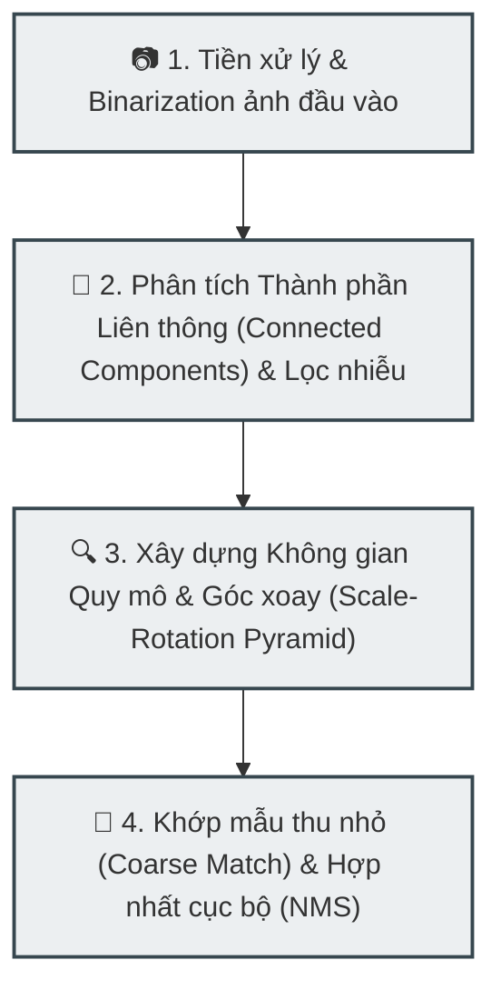

# Bộ nhận diện ký hiệu CAD Zero-Shot

Đây là hệ thống Nhận diện ký hiệu dạng Zero-Shot dành cho bản vẽ kỹ thuật (sơ đồ CAD / BOM). Hệ thống cho phép người dùng tải lên ảnh bản vẽ và một ảnh ký hiệu mẫu được cắt ra, sau đó tự động phát hiện tất cả các vị trí xuất hiện của ký hiệu đó trên bản vẽ.

## Tính năng nổi bật
- **Khả năng Zero-Shot mạnh mẽ**: Nhận diện tổng quát cho bất kỳ ký hiệu nào (Cầu chì, Điện trở, Điốt, v.v.) mà không cần huấn luyện lại mô hình.
- **Đa quy mô & Đa góc quay**: Hỗ trợ dải thay đổi kích thước (từ 0.02x đến 2.5x) và 8 hướng xoay góc khác nhau (từ 0° đến 315°).
- **Bộ lọc CAD nâng cao**:
  - Loại bỏ văn bản và nhiễu dựa trên chiều cao của các thành phần liên thông (Connected Component).
  - Bộ lọc bất đối xứng (Asymmetry filter) để loại bỏ nhiễu dạng đối xứng (ví dụ: các điểm nối dây) đối với ký hiệu bất đối xứng.
  - Loại bỏ khung tên bản vẽ và bảng thống kê vật tư (BOM) ở góc phải bản vẽ (tránh nhiễu khu vực bảng lưới x >= 1050).
- **Giao diện trực quan**: Thanh trượt điều chỉnh đa tham số trực tiếp trong thời gian thực, các chế độ cấu hình sẵn (Presets) chạy thử nhanh, phóng to thu nhỏ bản vẽ kết quả, và xuất tọa độ dạng JSON.

---

## 🔬 Quy Trình Xử Lý Thuật Toán (Pipeline Kiến Trúc)

Hệ thống sử dụng phương pháp khớp mẫu đa quy mô (Multi-scale Template Matching) kết hợp với các bộ lọc hình thái học và hình học để phát hiện ký hiệu dạng Zero-Shot. Quy trình xử lý gồm 4 giai đoạn chính:



### Giai đoạn 1: Tiền xử lý & Nhị phân hóa (Binarization)
* Trích xuất kênh màu xám từ ảnh bản vẽ kỹ thuật (Drawing) và ảnh ký hiệu mẫu (Template).
* Thực hiện thuật toán ngưỡng động (Adaptive Thresholding) hoặc ngưỡng tĩnh để chuyển đổi ảnh sang dạng nhị phân, phân tách rõ nét giữa các nét vẽ ký hiệu (foreground) và nền bản vẽ (background).

### Giai đoạn 2: Phân tích Connected Components (CC) & Lọc nhiễu thông tin
* Trích xuất các thành phần liên thông trên ảnh nhị phân để phân tích thuộc tính hình học (chiều cao, chiều rộng, diện tích pixel).
* **Bộ lọc văn bản**: Loại bỏ các đối tượng liên thông có kích thước tương đồng với ký tự văn bản hoặc nhiễu hạt nhỏ.
* **Bộ lọc BOM (Bill of Materials)**: Giới hạn tọa độ tìm kiếm $x < 1050$ để loại bỏ vùng nhiễu gây ra bởi lưới bảng biểu thống kê vật tư ở góc phải bản vẽ.

### Giai đoạn 3: Thiết lập Không gian Quy mô & Góc xoay (Pyramid Search)
* Do ký hiệu trên thực tế có thể thay đổi kích thước và hướng xoay so với ảnh mẫu mẫu:
  * Tạo một kim tự tháp ảnh mẫu (Template Pyramid) bằng cách thay đổi kích thước mẫu dựa trên dải tham số tỷ lệ đầu vào (Scale Space, ví dụ: $0.08, 0.1, 0.12$).
  * Với mỗi tỷ lệ, tiến hành xoay mẫu theo danh sách các góc xoay chỉ định (ví dụ: $0^\circ, 90^\circ, 180^\circ, 270^\circ$).

### Giai đoạn 4: So khớp Mẫu & Hợp nhất Bounding Box (Non-Maximum Suppression - NMS)
* Chạy thuật toán khớp mẫu chuẩn hóa (Normalized Cross-Correlation - NCC) trên ảnh đã lọc nhiễu để tính toán bản đồ mật độ xác suất (Similarity Map).
* Áp dụng ngưỡng coarse-matching ($TM\_Thresh$) để trích xuất các tọa độ ứng viên sơ bộ.
* Tính toán chỉ số Recall cục bộ (độ trùng khớp đường nét chi tiết) để đánh giá độ tin cậy của ứng viên.
* Áp dụng thuật toán Non-Maximum Suppression (NMS) để hợp nhất các ô định vị trùng lặp, giữ lại các ô có độ tự tin cao nhất và xuất kết quả tọa độ dưới định dạng JSON chuẩn.

---

## Chạy ứng dụng cục bộ

1. Cài đặt các thư viện cần thiết:
   ```bash
   pip install -r requirements.txt
   ```

2. Khởi chạy ứng dụng Gradio:
   ```bash
   python gradio_app.py
   ```

3. Mở trình duyệt tại địa chỉ `http://localhost:7860`.

## Chạy thử nghiệm xác minh cục bộ

Chạy lệnh dưới đây để kiểm tra hoạt động của công cụ lõi trên cả 3 trường hợp mẫu (Cầu chì, Điện trở, Điốt) và đảm bảo số lượng phát hiện chính xác:
```bash
python verify_examples.py
```
Script này sẽ chạy quy trình xử lý trên các ảnh mẫu trong thư mục `examples/` và lưu các ảnh trực quan hóa kết quả dưới dạng `verify_*_output.png`.
