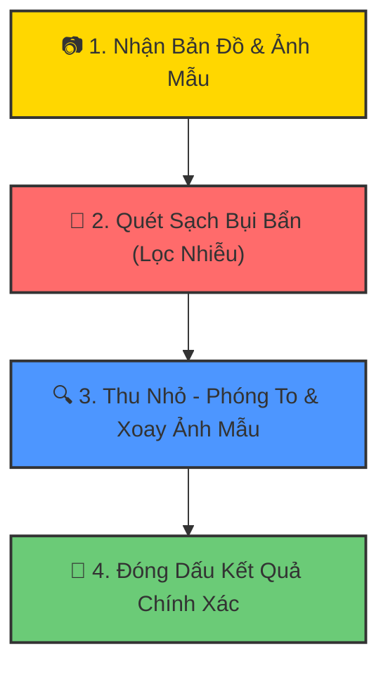

# Bộ nhận diện ký hiệu CAD Zero-Shot

Đây là hệ thống Nhận diện ký hiệu dạng Zero-Shot dành cho bản vẽ kỹ thuật (sơ đồ CAD / BOM). Hệ thống cho phép người dùng tải lên ảnh bản vẽ và một ảnh ký hiệu mẫu được cắt ra, sau đó tự động phát hiện tất cả các vị trí xuất hiện của ký hiệu đó trên bản vẽ.

## Tính năng nổi bật
- **Khả năng Zero-Shot mạnh mẽ**: Nhận diện tổng quát cho bất kỳ ký hiệu nào (Cầu chì, Điện trở, Điốt, v.v.) mà không cần huấn luyện lại mô hình.
- **Đa quy mô & Đa góc quay**: Hỗ trợ dải thay đổi kích thước (từ 0.02x đến 2.5x) và 8 hướng xoay góc khác nhau (từ 0° đến 315°).
- **Bộ lọc CAD nâng cao**:
  - Loại bỏ văn bản và nhiễu dựa trên chiều cao của các thành phần liên thông (Connected Component).
  - Bộ lọc bất đối xứng (Asymmetry filter) để loại bỏ nhiễu dạng đối xứng (ví dụ: các điểm nối dây) đối với ký hiệu bất đối xứng.
  - Loại bỏ khung tên bản vẽ và bảng thống kê vật tư (BOM) ở góc phải bản vẽ (tránh nhiễu khu vực bảng lưới x >= 1050).
- **Giao diện trực quan**: Thanh trượt điều chỉnh đa tham số trực tiếp trong thời gian thực, các chế độ cấu hình sẵn (Presets) chạy thử nhanh, phóng to thu nhỏ bản vẽ kết quả, và xuất tọa độ dạng JSON.

---

## 🧩 Thuật Toán Hoạt Động Như Thế Nào? (Giải thích siêu dễ hiểu! 🐣)

Hãy tưởng tượng bạn đang chơi trò **"Đi tìm ẩn số"** (Where's Wally?) trên một bức tranh khổng lồ. Thay vì tìm người, chúng ta cần tìm các **ký hiệu điện tí hon** (như Cầu chì 🔌, Điện trở ⬛, Điốt 🔺). 

Hệ thống AI tí hon này tự học và làm việc qua **4 bước phiêu lưu** siêu ngầu sau:



### 🎬 Bước 1: Xem mặt "Kẻ trốn tìm" (Nhận ảnh đầu vào)
* Bạn đưa cho máy tính một **Bản đồ khổng lồ** (Ảnh bản vẽ kỹ thuật) và **Ảnh chân dung kẻ trốn tìm** (Ký hiệu mẫu).

### 🧹 Bước 2: Dọn dẹp nhà cửa (Lọc chữ viết & Khung vẽ)
* Bản vẽ có rất nhiều chữ viết rối mắt và các bảng thông tin góc phải. 
* Máy tính sẽ dùng một chiếc **chổi thần kỳ** để tạm thời quét sạch các chữ viết và đường kẻ thừa đi, chỉ giữ lại các ký hiệu để tìm kiếm dễ hơn.

### 🔍 Bước 3: Thu nhỏ - Phóng to & Xoay vòng tròn
* Kẻ trốn tìm trên bản đồ có thể đang **nằm ngửa**, **nằm nghiêng** (quay góc 90°, 180°, 270°) hoặc **to nhỏ khác nhau**.
* Máy tính sẽ tự động **nhân bản** ảnh mẫu thành hàng chục phiên bản khác nhau: xoay đủ hướng và phóng to thu nhỏ đủ kích cỡ để mang đi so khớp.

### 🎯 Bước 4: Đóng dấu "Tìm thấy rồi!"
* Máy tính cầm các tấm ảnh mẫu đã xoay/phóng to đi quét khắp bản vẽ (như cầm kính lúp dò từng ô).
* Ở những nơi có hình dáng khớp nhất, máy tính sẽ vẽ một **khung hình chữ nhật màu đỏ** rực rỡ và ghi điểm số tự tin! 
* Kết quả cuối cùng sẽ xuất ra một danh sách tọa độ (JSON) vô cùng ngăn nắp.

---

## Chạy ứng dụng cục bộ

1. Cài đặt các thư viện cần thiết:
   ```bash
   pip install -r requirements.txt
   ```

2. Khởi chạy ứng dụng Gradio:
   ```bash
   python gradio_app.py
   ```

3. Mở trình duyệt tại địa chỉ `http://localhost:7860`.

## Chạy thử nghiệm xác minh cục bộ

Chạy lệnh dưới đây để kiểm tra hoạt động của công cụ lõi trên cả 3 trường hợp mẫu (Cầu chì, Điện trở, Điốt) và đảm bảo số lượng phát hiện chính xác:
```bash
python verify_examples.py
```
Script này sẽ chạy quy trình xử lý trên các ảnh mẫu trong thư mục `examples/` và lưu các ảnh trực quan hóa kết quả dưới dạng `verify_*_output.png`.
