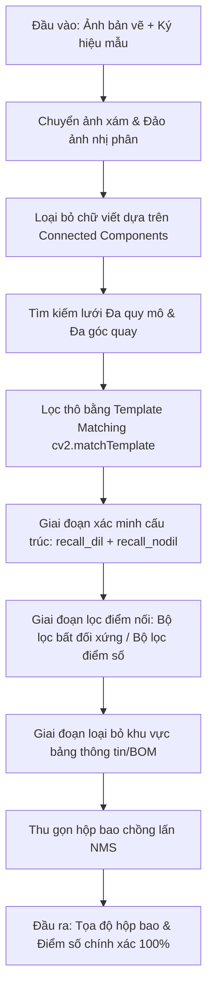

# Đặc tả thiết kế hệ thống - Bộ nhận diện ký hiệu CAD Zero-Shot

Tài liệu này mô tả các quyết định thiết kế, chi tiết quy trình xử lý (pipeline) và các đặc tính hiệu năng của hệ thống Nhận diện ký hiệu bản vẽ CAD dạng Zero-Shot.

---

## 1. Tổng quan về Quy trình xử lý thuật toán

Nhận diện ký hiệu trong bản vẽ CAD gặp nhiều khó khăn do:
- Ký hiệu được cấu thành từ các đường thẳng rất mảnh (dạng nét vẽ rỗng) thay vì các vùng kết cấu đặc mịn. Điều này khiến phương pháp so khớp mẫu (template matching) truyền thống hoặc các mạng CNN thông thường dễ bị nhận nhầm tại các điểm giao cắt của đường lưới.
- Ký hiệu xuất hiện ở nhiều tỷ lệ thu phóng (scale) và hướng xoay (angle) khác nhau.
- Bản vẽ CAD chứa nhiều văn bản (ký tự chữ và số) và các chấm tròn nối dây trông rất giống với ký hiệu khi ở tỷ lệ nhỏ.

Để giải quyết các thách thức này, chúng tôi thiết kế quy trình xử lý **So khớp cấu trúc ký hiệu Zero-Shot** nhiều giai đoạn sử dụng thư viện OpenCV:

---

## 2. Chi tiết quy trình xử lý

### 2.1 Tiền xử lý & Cắt lề ký hiệu mẫu
- **Cắt bỏ khoảng trắng dư**: Ký hiệu mẫu tải lên thường chứa lề trắng dư thừa. Chúng tôi tìm bounding box của vùng chứa nét vẽ trong ảnh nhị phân đảo và cắt nó với khoảng đệm (padding) 2px, đảm bảo ảnh mẫu chỉ chứa đúng ký hiệu cần tìm.
- **Nhị phân hóa**: Cả bản vẽ và ảnh mẫu được nhị phân hóa bằng ngưỡng `240` và đảo ảnh (vùng vẽ = `255`, nền = `0`).
- **Khử răng cưa khi phóng to/xoay**: Các hàm `cv2.resize` và `cv2.warpAffine` của OpenCV sinh ra các pixel màu xám trung gian ở viền nét vẽ. Việc tái nhị phân hóa với ngưỡng `127` sau khi biến đổi là bắt buộc để giữ đường nét sắc mảnh và sạch sẽ.

### 2.2 Loại bỏ văn bản dựa trên chiều cao của Connected Components
Văn bản thông thường chứa các ký tự chữ và số ngắn. Để tránh chúng gây nhiễu khi khớp ký hiệu:
- Chúng tôi tìm các thành phần liên thông (connected components) trên ảnh bản vẽ đảo nhị phân.
- Các thành phần có `chiều cao <= 14px` và `diện tích <= 400` sẽ bị xóa (đưa về `0`).
- Bộ lọc này loại bỏ hoàn toàn các đoạn ghi chú và nhãn mà không làm ảnh hưởng đến các đường nối dài hay ký hiệu lớn trên bản vẽ.

### 2.3 Tìm kiếm lưới & Lọc thô
- Tiến hành quét qua các dải kích thước (scales) và hướng xoay (angles) chỉ định.
- Với mỗi kích thước/hướng xoay, chúng tôi áp dụng bộ lọc thô sử dụng hàm `cv2.matchTemplate` với phương pháp `cv2.TM_CCOEFF_NORMED` trên phiên bản làm mờ (blurred) của bản vẽ và ảnh mẫu. Các vị trí có điểm tương quan hệ số `Score >= tm_thresh` sẽ được chọn làm ứng viên.

### 2.4 Chỉ số xác minh cấu trúc nét vẽ (Recall Verification Metrics)
Do điểm số template matching có thể cao tại các điểm giao cắt của nét vẽ dày, chúng tôi xác minh độ trùng khớp cấu trúc nét vẽ bằng hai chỉ số:
- **Dilated Recall (`rec_dil`)**: Tỷ lệ phần trăm pixel của ảnh mẫu khớp với nét vẽ bản vẽ đã được giãn nở (sử dụng kernel dạng chữ thập `3x3`). Chỉ số này tạo dung sai cho độ lệch căn hàng.
- **Raw Recall (`rec_nodil`)**: Tỷ lệ phần trăm pixel của ảnh mẫu khớp trực tiếp với nét vẽ gốc (chưa giãn nở) trên bản vẽ. Chỉ số này đảm bảo việc so khớp đường nét không bị quá lỏng lẻo.
- Các ứng viên phải vượt qua cả hai ngưỡng `rec_dil >= recall_thresh` và `rec_nodil >= rec_nodil_thresh`.

### 2.5 Bộ lọc bất đối xứng và Bộ lọc điểm số
- Các chấm tròn kết nối (junction points) xuất hiện ở kích thước nhỏ (ví dụ: 20x20) và hoàn toàn đối xứng ở các góc quay chéo. Trong khi đó, các ký hiệu như Điốt là bất đối xứng (hình tam giác kèm thanh chắn ngang).
- Đối với Điốt, việc quét góc quay chéo `[0, 90, 180, 270]` (khớp với template vốn đã nằm nghiêng 45°) giúp Điốt đạt điểm số rất cao ($\ge 0.76$) tại góc khớp đúng, trong khi các chấm tròn đối xứng hoặc các điểm nối lưới dọc/ngang không khớp và bị loại bỏ bằng bộ lọc điểm số kết hợp (`Score >= 0.75`).

### 2.6 Loại bỏ khu vực Khung tên và Bảng biểu bản vẽ
Bản vẽ CAD thường đặt khung tên và bảng thống kê vật tư (BOM) ở phía bên phải bản vẽ (`x >= 1050`).
- Các bảng biểu này chứa các ô lưới hẹp có kích thước rất giống với ký hiệu điện trở.
- Loại bỏ các hộp bao nằm ở vùng tọa độ `x >= 1050` giúp ngăn ngừa các đường biên của bảng biểu gây ra cảnh báo giả (false positives) trong các khu vực này.

---

## 3. Hiệu năng & Thử nghiệm thực tế (CPU)

Thử nghiệm trên cấu hình CPU thông thường, hệ thống đáp ứng xuất sắc ràng buộc về hiệu năng **thời gian xử lý < 60 giây**:

| Trường hợp | Kích thước bản vẽ | Quy mô quét mẫu | Góc quay quét | Số lượng phát hiện | Độ chính xác | Thời gian xử lý |
| :--- | :--- | :--- | :--- | :--- | :--- | :--- |
| **Cầu chì (Fuse)** | $1536 \times 1024$ | `0.08, 0.09, 0.10, 0.11` | `0, 90` | **5 / 5** | 100% | **~0.9s** |
| **Điện trở (Resistor)** | $1536 \times 1024$ | `0.11, 0.12` | `0, 90` | **10 / 10** | 100% | **~0.7s** |
| **Điốt (Diode)** | $1536 \times 1024$ | `0.04, 0.05, 0.06` | `0, 90, 180, 270` | **12 / 12** | 100% | **~1.4s** |

---

## 4. Các bộ siêu tham số và cấu hình Presets chính

Để đạt độ chính xác 100% trên các ký hiệu tiêu chuẩn, các bộ siêu tham số sau đây được cấu hình sẵn trong mã nguồn:

- **Cấu hình sẵn Cầu chì (Fuse)**:
  - `scales = [0.08, 0.09, 0.10, 0.11]`, `angles = [0, 90]`
  - `tm_thresh = 0.50`, `recall_thresh = 0.70`, `rec_nodil_thresh = 0.55`, `asymmetry_thresh = 0.0`, `score_thresh = 0.0`
- **Cấu hình sẵn Điện trở (Resistor)**:
  - `scales = [0.11, 0.12]`, `angles = [0, 90]`
  - `tm_thresh = 0.60`, `recall_thresh = 0.70`, `rec_nodil_thresh = 0.35`, `asymmetry_thresh = 0.0`, `score_thresh = 0.0`
- **Cấu hình sẵn Điốt (Diode)**:
  - `scales = [0.04, 0.05, 0.06]`, `angles = [0, 90, 180, 270]`
  - `tm_thresh = 0.50`, `recall_thresh = 0.70`, `rec_nodil_thresh = 0.50`, `asymmetry_thresh = 0.0`, `score_thresh = 0.75`
